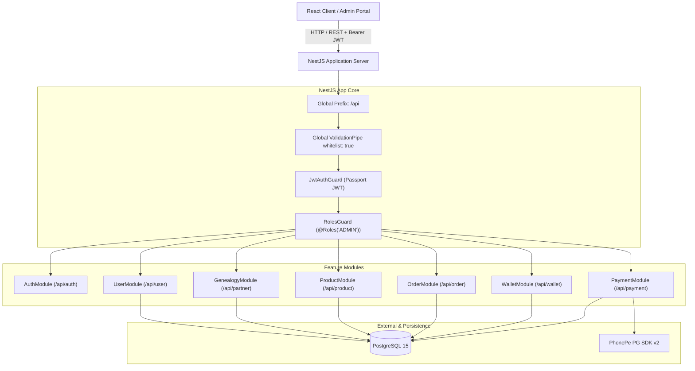

# VEDORA Backend — System Architecture & Design

This document details the architectural principles, layer structure, concurrency patterns, and security mechanisms powering the VEDORA Backend.

---

## 1. High-Level Architecture Overview

VEDORA is built as a modular monolithic backend using **NestJS 12**, **TypeScript 6**, **TypeORM 1.1**, and **PostgreSQL 15**.



---

## 2. Core Modules Breakdown

The backend is cleanly structured into 7 domain modules:

### 2.1 `AuthModule`
- **Purpose:** Manages authentication, issuance of JSON Web Tokens, and password reset flows.
- **Key Services:** `AuthService`, `JwtStrategy`.
- **JWT Payload:** `{ sub: userId, vedId: string, role: UserRole }`.
- **Password Reset:** Generates 6-digit cryptographic OTPs saved in the `otps` table with 15-minute expirations.

### 2.2 `UserModule`
- **Purpose:** User lifecycle, extended profile details, and bank account management.
- **Key Entities:** `User`, `UserProfile`, `UserBank`.
- **Security:**
  - Password hashing with `bcrypt` (10 rounds).
  - Admin-only routes for user creation, status changes, and account deletion.
  - Self-service endpoints for profile, password updates, and bank account additions.

### 2.3 `GenealogyModule`
- **Purpose:** Core Multi-Level Marketing (MLM) logic, 20-slot width matrix, parent-child tree mapping, and 5-level commission upline chain.
- **Key Entities:** `GenealogyNode`, `CommissionUpline`.
- **Width Limitation:** Strictly maximum 20 direct children per sponsor (slots 1..20).
- **Sequential VED IDs:** Generated atomically using PostgreSQL sequence `ved_id_seq` with 6-digit zero padding (`VED000004`, `VED000005`, etc.).

### 2.4 `ProductModule`
- **Purpose:** Product catalog, inventory management, pricing (MRP vs. Sale Price), and Business Volume (BV) configuration for MLM commission calculations.
- **Key Entities:** `Product`.
- **RBAC:** Partners can view active products. Only `ADMIN` can create, update, or delete products.

### 2.5 `OrderModule`
- **Purpose:** Shopping cart, online checkout orders, admin offline cash orders, and automatic 5-level commission distribution engine.
- **Key Entities:** `Order`, `CommissionDistribution`.
- **Order Types:**
  - **Online (`PHONEPE`):** Starts in `PENDING` state. Upon payment gateway webhook confirmation, automatically confirms order and triggers commission distribution.
  - **Cash (`CASH`):** Created by Admin on behalf of a partner. Marked `PAID` + `CONFIRMED` immediately, instantly crediting commissions to upline wallets.

### 2.6 `WalletModule`
- **Purpose:** High-integrity double-entry digital wallet ledger, balance tracking, and payout withdrawal management.
- **Key Entities:** `Wallet`, `WalletTransaction`, `Withdrawal`.
- **Currencies:** Stored in **Paise** (`amount / 100` = ₹ Rupees) to prevent floating-point calculation errors.
- **Withdrawal Workflow:** Requires `VERIFIED` bank account and min ₹100. Balance is moved from `availableBalance` to `lockedBalance` upon request, and debited to `totalWithdrawn` upon Admin approval.

### 2.7 `PaymentModule`
- **Purpose:** Standard Checkout integration with PhonePe Payment Gateway (V2 SDK).
- **Key Services:** `PaymentService`.
- **Key Features:** Payment initiation, redirect callback handler, server-to-server webhook processing, and manual order status polling.

---

## 3. Concurrency & Data Integrity

To maintain financial accuracy and eliminate race conditions in high-traffic MLM registration and order processing:

### 3.1 Sponsor Slot Allocation Lock
When concurrent users register under the same sponsor simultaneously, the backend utilizes **Pessimistic Write Locking (`FOR UPDATE`)**:
```typescript
const sponsor = await userRepo
  .createQueryBuilder('user')
  .setLock('pessimistic_write')
  .where('user.ved_id = :vedId', { vedId: dto.referralId })
  .getOne();
```
This forces concurrent registrations to queue sequentially, preventing race conditions where two partners might be assigned the same slot number.

### 3.2 Wallet Double-Entry Balance Locking
Before debiting or locking wallet balances for withdrawals, the target wallet record is locked:
```typescript
const wallet = await walletRepo
  .createQueryBuilder('wallet')
  .setLock('pessimistic_write')
  .where('wallet.user_id = :userId', { userId })
  .getOne();
```
All balance transitions (`availableBalance`, `lockedBalance`, `totalWithdrawn`, `totalEarned`) are paired with an immutable entry in `wallet_transactions`.

---

## 4. Role-Based Access Control (RBAC)

RBAC is enforced via custom decorators and guards applied at the controller and route level:

```typescript
@Roles('ADMIN')
@UseGuards(JwtAuthGuard, RolesGuard)
```

### Access Matrix Summary
| Endpoint Pattern | Public | Partner | Founder | Admin |
|---|:---:|:---:|:---:|:---:|
| `POST /api/auth/login` | ✅ | ✅ | ✅ | ✅ |
| `POST /api/auth/forgot-password` | ✅ | ✅ | ✅ | ✅ |
| `POST /api/partner/join` | ✅ | ✅ | ✅ | ✅ |
| `GET /api/product` (Browse) | ❌ | ✅ | ✅ | ✅ |
| `POST /api/order` (Checkout) | ❌ | ✅ | ✅ | ✅ |
| `POST /api/wallet/withdraw` | ❌ | ✅ | ✅ | ✅ |
| `POST /api/product` (Create) | ❌ | ❌ | ❌ | 🔒 Admin |
| `PATCH /api/product/:id` | ❌ | ❌ | ❌ | 🔒 Admin |
| `POST /api/order/admin/cash` | ❌ | ❌ | ❌ | 🔒 Admin |
| `GET /api/order/admin/all` | ❌ | ❌ | ❌ | 🔒 Admin |
| `GET /api/wallet/admin/withdrawals`| ❌ | ❌ | ❌ | 🔒 Admin |
| `PATCH /api/wallet/admin/withdrawal/:id/*` | ❌ | ❌ | ❌ | 🔒 Admin |
| `GET /api/partner/:vedId/genealogy` | ❌ | ❌ | ❌ | 🔒 Admin |
| `PATCH /api/user/status` | ❌ | ❌ | ❌ | 🔒 Admin |

---

## 5. Security & Best Practices

1. **Password Encryption:** Passwords are never stored in plain text. Salted bcrypt hashing with a work factor of 10 is used.
2. **DTO Validation:** Global `ValidationPipe` with `{ whitelist: true, transform: true }` strips unknown fields and validates types.
3. **Database Connection:** Configured via `TypeOrmModule` with connection pooling and SSL readiness.
4. **Environment Security:** Sensitive secrets (`JWT_SECRET`, `PHONEPE_CLIENT_SECRET`, database credentials) are injected via `@nestjs/config` from `.env`.
