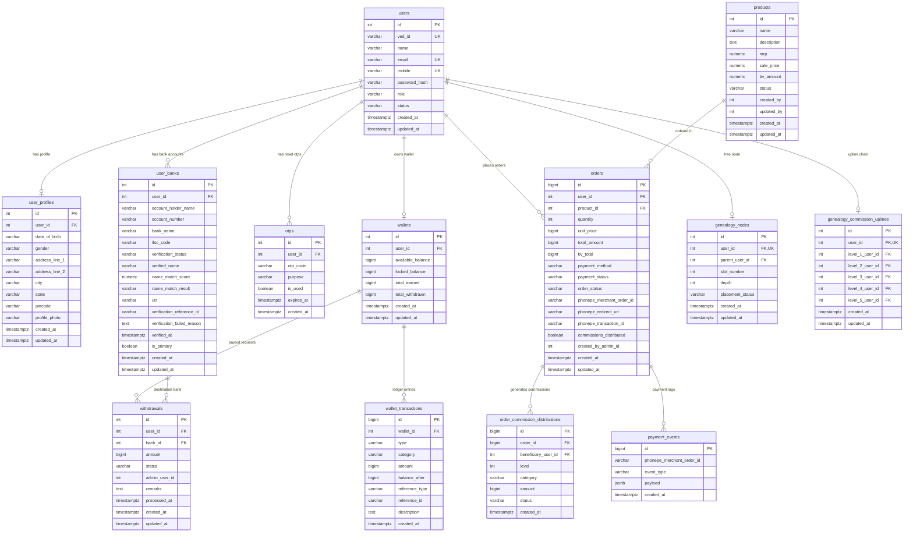

# VEDORA Backend — Database Schema & ERD Documentation

This document describes the PostgreSQL database schema for the VEDORA platform, managed via TypeORM migrations and entities.

---

## 1. Entity-Relationship Diagram (ERD)



---

## 2. Table Specifications

### 2.1 `users`
Primary user table storing authentication, contact information, role, and status.
- `id` (SERIAL, PK)
- `ved_id` (VARCHAR(20), UNIQUE, NOT NULL) — e.g. `VED108`, `VED000001`, `VED000015`
- `name` (VARCHAR(150), NOT NULL)
- `email` (VARCHAR(255), UNIQUE, NOT NULL)
- `mobile` (VARCHAR(20), UNIQUE, NOT NULL)
- `password_hash` (VARCHAR(255), NOT NULL) — Salted bcrypt hash
- `role` (VARCHAR(20), DEFAULT `'PARTNER'`) — `'ADMIN'`, `'FOUNDER'`, `'PARTNER'`
- `status` (VARCHAR(20), DEFAULT `'PENDING'`) — `'PENDING'`, `'ACTIVE'`, `'INACTIVE'`, `'BLOCKED'`
- `created_at`, `updated_at` (TIMESTAMPTZ(3))

### 2.2 `user_profiles`
Extended KYC and profile information for a user.
- `id` (SERIAL, PK)
- `user_id` (INT, UNIQUE, FK -> `users.id` ON DELETE CASCADE)
- `date_of_birth` (DATE / VARCHAR, NULLABLE)
- `gender` (VARCHAR(20), NULLABLE) — `'MALE'`, `'FEMALE'`, `'OTHER'`
- `address_line_1`, `address_line_2` (VARCHAR(255), NULLABLE)
- `city`, `state`, `pincode` (VARCHAR(100), NULLABLE)
- `profile_photo` (TEXT, NULLABLE)

### 2.3 `user_banks`
Saved bank accounts for partner payouts, verified via Penny Drop.
- `id` (SERIAL, PK)
- `user_id` (INT, FK -> `users.id` ON DELETE CASCADE)
- `account_holder_name` (VARCHAR(150), NOT NULL) — Name entered by user
- `account_number` (VARCHAR(50), NOT NULL) — Destination bank account (9-18 digits)
- `bank_name` (VARCHAR(150), NOT NULL) — Name of the bank (e.g. HDFC Bank)
- `ifsc_code` (VARCHAR(20), NOT NULL) — 11-character RBI standard IFSC code
- `verification_status` (VARCHAR(20), DEFAULT `'PENDING'`) — `'PENDING'`, `'VERIFIED'`, `'REJECTED'`
- `verified_name` (VARCHAR(150), NULLABLE) — Official name returned by destination bank during penny drop
- `name_match_score` (NUMERIC(5,2), NULLABLE) — Fuzzy matching score (0.00 to 100.00)
- `name_match_result` (VARCHAR(30), NULLABLE) — Categorization (`DIRECT`, `GOOD`, `MODERATE`, `POOR`, `NO_MATCH`)
- `utr` (VARCHAR(100), NULLABLE) — Unique Transaction Reference of the ₹1 transfer from bank
- `verification_reference_id` (VARCHAR(100), NULLABLE) — Cashfree verification transaction reference
- `verification_failed_reason` (TEXT, NULLABLE) — Failure or mismatch reason if rejected
- `verified_at` (TIMESTAMPTZ(3), NULLABLE) — Timestamp when verification was completed
- `is_primary` (BOOLEAN, DEFAULT FALSE) — Whether this is the default payout bank account
- `created_at`, `updated_at` (TIMESTAMPTZ(3))

### 2.4 `genealogy_nodes`
Tracks user positions in the 20-slot width MLM tree.
- `id` (SERIAL, PK)
- `user_id` (INT, UNIQUE, FK -> `users.id` ON DELETE CASCADE)
- `parent_user_id` (INT, FK -> `users.id` ON DELETE SET NULL, NULLABLE)
- `slot_number` (INT, NULLABLE) — Values 1 to 20
- `depth` (INT, DEFAULT 1) — Level in the hierarchy
- `placement_status` (VARCHAR(20), DEFAULT `'ACTIVE'`)
- **Unique Constraint:** `(parent_user_id, slot_number)` ensures no two partners share the same slot under a sponsor.

### 2.5 `genealogy_commission_uplines`
Pre-computed 5-level commission upline paths for $O(1)$ fast commission calculation.
- `id` (SERIAL, PK)
- `user_id` (INT, UNIQUE, FK -> `users.id` ON DELETE CASCADE)
- `level_1_user_id` (INT, NULLABLE) — Direct sponsor
- `level_2_user_id` (INT, NULLABLE) — Sponsor's sponsor
- `level_3_user_id` (INT, NULLABLE)
- `level_4_user_id` (INT, NULLABLE)
- `level_5_user_id` (INT, NULLABLE)

### 2.6 `products`
Store products for purchasing.
- `id` (SERIAL, PK)
- `name` (VARCHAR(255), NOT NULL)
- `description` (TEXT, NULLABLE)
- `mrp` (NUMERIC(10,2), NOT NULL) — Maximum retail price
- `sale_price` (NUMERIC(10,2), NOT NULL) — Selling price
- `bv_amount` (NUMERIC(10,2), NOT NULL) — Business Volume for MLM commission calculation
- `status` (VARCHAR(20), DEFAULT `'ACTIVE'`) — `'ACTIVE'`, `'INACTIVE'`
- `created_by`, `updated_by` (INT, NULLABLE)

### 2.7 `orders`
Purchases and checkout orders.
- `id` (BIGSERIAL, PK)
- `user_id` (INT, FK -> `users.id`)
- `product_id` (INT, FK -> `products.id`)
- `quantity` (INT, DEFAULT 1)
- `unit_price` (BIGINT, NOT NULL) — In Paise
- `total_amount` (BIGINT, NOT NULL) — In Paise
- `bv_total` (BIGINT, NOT NULL) — Total Business Volume
- `payment_method` (VARCHAR(20), NOT NULL) — `'PHONEPE'`, `'CASH'`
- `payment_status` (VARCHAR(20), DEFAULT `'PENDING'`) — `'PENDING'`, `'PAID'`, `'FAILED'`, `'REFUNDED'`
- `order_status` (VARCHAR(20), DEFAULT `'PENDING'`) — `'PENDING'`, `'PLACED'`, `'CONFIRMED'`, `'SHIPPED'`, `'DELIVERED'`, `'CANCELLED'`
- `phonepe_merchant_order_id` (VARCHAR(100), UNIQUE, NULLABLE)
- `phonepe_redirect_url` (TEXT, NULLABLE)
- `phonepe_transaction_id` (VARCHAR(100), NULLABLE)
- `commissions_distributed` (BOOLEAN, DEFAULT FALSE)
- `created_by_admin_id` (INT, NULLABLE)

### 2.8 `order_commission_distributions`
Audit trail of commissions distributed per order.
- `id` (BIGSERIAL, PK)
- `order_id` (BIGINT, FK -> `orders.id`)
- `beneficiary_user_id` (INT, FK -> `users.id`)
- `level` (INT, NOT NULL) — Level 0 (Direct), 1, 2, 3, 4, 5
- `category` (VARCHAR(50), NOT NULL)
- `amount` (BIGINT, NOT NULL) — In Paise
- `status` (VARCHAR(20), DEFAULT `'CREDITED'`)

### 2.9 `wallets`
Aggregated wallet balance for each user.
- `id` (SERIAL, PK)
- `user_id` (INT, UNIQUE, FK -> `users.id` ON DELETE CASCADE)
- `available_balance` (BIGINT, DEFAULT 0) — Available for withdrawal (in paise)
- `locked_balance` (BIGINT, DEFAULT 0) — Locked during pending withdrawal (in paise)
- `total_earned` (BIGINT, DEFAULT 0) — Lifetime earnings (in paise)
- `total_withdrawn` (BIGINT, DEFAULT 0) — Total approved payouts (in paise)

### 2.10 `wallet_transactions`
Double-entry transaction ledger.
- `id` (BIGSERIAL, PK)
- `wallet_id` (INT, FK -> `wallets.id` ON DELETE CASCADE)
- `type` (VARCHAR(20), NOT NULL) — `'CREDIT'`, `'DEBIT'`
- `category` (VARCHAR(50), NOT NULL) — `'COMMISSION_DIRECT'`, `'COMMISSION_LEVEL_1'`..`5`, `'WITHDRAWAL'`, `'PURCHASE'`, etc.
- `amount` (BIGINT, NOT NULL) — In Paise
- `balance_after` (BIGINT, NOT NULL) — Available balance after transaction
- `reference_type` (VARCHAR(50), NULLABLE) — `'ORDER'`, `'WITHDRAWAL'`
- `reference_id` (VARCHAR(100), NULLABLE)
- `description` (TEXT, NOT NULL)
- `created_at` (TIMESTAMPTZ(3))

### 2.11 `withdrawals`
Bank payout requests.
- `id` (SERIAL, PK)
- `user_id` (INT, FK -> `users.id`)
- `bank_id` (INT, FK -> `user_banks.id`)
- `amount` (BIGINT, NOT NULL) — In Paise
- `status` (VARCHAR(20), DEFAULT `'PENDING'`) — `'PENDING'`, `'APPROVED'`, `'REJECTED'`
- `admin_user_id` (INT, NULLABLE) — ID of the admin who approved/rejected
- `remarks` (TEXT, NULLABLE)
- `processed_at` (TIMESTAMPTZ(3), NULLABLE)

### 2.12 `payment_events`
Raw logs of all incoming webhook and payment events from PhonePe.
- `id` (BIGSERIAL, PK)
- `phonepe_merchant_order_id` (VARCHAR(100), NOT NULL)
- `event_type` (VARCHAR(50), NOT NULL) — `'WEBHOOK'`, `'STATUS_CHECK'`, `'CALLBACK'`
- `payload` (JSONB, NOT NULL)
- `created_at` (TIMESTAMPTZ(3))

---

## 3. Sequence Generator

- **`ved_id_seq`:** A dedicated PostgreSQL sequence starting at 4 used to generate sequential VED IDs:
  ```sql
  CREATE SEQUENCE IF NOT EXISTS ved_id_seq START WITH 4 INCREMENT BY 1;
  ```
  IDs 1 to 3 are reserved for the 3 Permanent Founders (`VED000001`, `VED000002`, `VED000003`). Root Admin is `VED108`.
