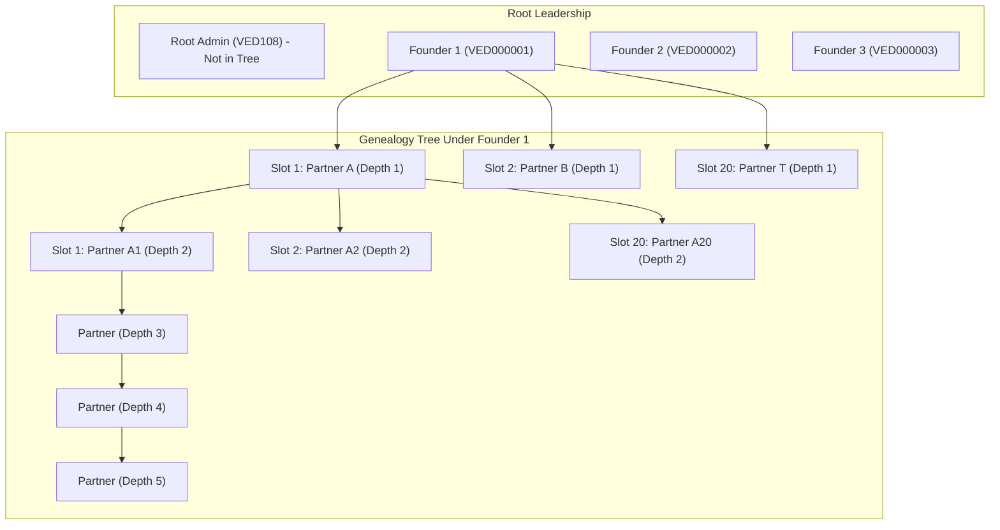

# VEDORA — Genealogy & Multi-Level Commission System

This document outlines the Multi-Level Marketing (MLM) structure, slot assignment rules, 5-level commission engine, and active-partner qualification rules of the VEDORA platform.

---

## 1. Network Structure & Hierarchy

VEDORA operates on a **20-Width Slot Matrix** with a **5-Level Depth Commission** model.



### 1.1 Key Network Rules:
1. **Root Admin (`VED108`):** The system administrator. Does NOT occupy any position in the genealogy tree and cannot sponsor partners.
2. **Fixed Permanent Founders (`VED000001`, `VED000002`, `VED000003`):**
   - Seeded permanently in the database.
   - Act as root referral sponsors for incoming partners.
   - Do not have a parent sponsor (their depth is 0).
3. **Maximum 20 Direct Partners per Sponsor:**
   - Every sponsor (Founder or Partner) has exactly **20 slots** (numbered `1` to `20`).
   - Once a sponsor has 20 direct partners, their capacity is full. Any additional registrations under their referral code will fail with `400 Bad Request`.
4. **Slot Assignment:**
   - **Auto-assignment:** If no slot number is provided, the system allocates the lowest available slot number between 1 and 20.
   - **Manual selection:** A sponsor can explicitly assign a specific slot number (1–20) via `POST /api/partner/register-downline`.

---

## 2. Pre-Computed 5-Level Commission Uplines

To avoid expensive recursive SQL queries during order checkout, the system maintains a pre-calculated upline record for every user in the `genealogy_commission_uplines` table:

| Field | Meaning |
|---|---|
| `user_id` | The partner making the purchase |
| `level_1_user_id` | Direct parent / sponsor |
| `level_2_user_id` | Level 1's sponsor |
| `level_3_user_id` | Level 2's sponsor |
| `level_4_user_id` | Level 3's sponsor |
| `level_5_user_id` | Level 4's sponsor |

When a partner joins, their upline chain is derived in $O(1)$ time by shifting their sponsor's existing upline:
$$\text{Level } (N+1)_{\text{child}} = \text{Level } N_{\text{sponsor}}$$

---

## 3. The 5-Level Compensation Plan

Commissions are calculated whenever an order is marked `PAID` and `CONFIRMED` (either via PhonePe webhook or Admin cash order).

### 3.1 Commission Breakdown

| Commission Level | Beneficiary | Calculation Basis | Rate / Amount |
|:---:|:---:|:---:|:---:|
| **Direct Referral Bonus** | Direct Sponsor (`level_1_user_id`) | Flat Payout | **₹200.00** flat (20,000 paise) |
| **Level 1** | `level_1_user_id` | Business Volume (BV) | **10%** of total BV |
| **Level 2** | `level_2_user_id` | Business Volume (BV) | **10%** of total BV |
| **Level 3** | `level_3_user_id` | Business Volume (BV) | **10%** of total BV |
| **Level 4** | `level_4_user_id` | Business Volume (BV) | **5%** of total BV |
| **Level 5** | `level_5_user_id` | Business Volume (BV) | **5%** of total BV |

> [!NOTE]
> **Business Volume (BV):** Each product has a configured `bvAmount`.
> $\text{1 BV} = \text{₹1.00} = \text{100 paise}$.
> For an order of quantity $Q$:
> $$\text{Total BV} = \text{Product BV} \times Q$$

---

## 4. Active Partner Qualification Rule

Commissions are only distributed to active distributors:

```typescript
// src/order/order.service.ts
if (!beneficiary || beneficiary.status !== UserStatus.ACTIVE) {
  this.logger.log(
    `Skipping level ${config.level} commission for user ${beneficiaryUserId} (status: ${beneficiary?.status})`
  );
  continue; // Commission is forfeited if user is not ACTIVE
}
```

- If an upline user's status is `PENDING`, `INACTIVE`, or `BLOCKED`, the commission for that level is **skipped**.
- By default, newly registered partners start in `PENDING` status until activated.

---

## 5. End-to-End Calculation Example

Suppose:
1. Product: **Vedora Health Supplement**
   - MRP: ₹1,500
   - Sale Price: ₹1,200
   - **BV: 500** (₹500 value)
2. Buyer: **Partner E** purchases **2 units** (Total Amount = ₹2,400, Total BV = **1,000 BV** = ₹1,000).
3. Network Chain:
   $$\text{Founder 1 (A)} \longrightarrow \text{Partner B} \longrightarrow \text{Partner C} \longrightarrow \text{Partner D} \longrightarrow \text{Partner E (Buyer)}$$

### Commission Distribution:

1. **Direct Referral Bonus:**
   - Beneficiary: **Partner D** (Direct Sponsor)
   - Payout: **₹200.00** flat
   - Wallet credited: ₹200.00

2. **Level 1 Commission:**
   - Beneficiary: **Partner D**
   - Calculation: $10\% \times 1,000 \text{ BV} = \text{₹100.00}$
   - Partner D total received: $\text{₹200 (Direct Bonus)} + \text{₹100 (Level 1)} = \mathbf{₹300.00}$

3. **Level 2 Commission:**
   - Beneficiary: **Partner C**
   - Calculation: $10\% \times 1,000 \text{ BV} = \mathbf{₹100.00}$

4. **Level 3 Commission:**
   - Beneficiary: **Partner B**
   - Calculation: $10\% \times 1,000 \text{ BV} = \mathbf{₹100.00}$

5. **Level 4 Commission:**
   - Beneficiary: **Founder 1 (A)**
   - Calculation: $5\% \times 1,000 \text{ BV} = \mathbf{₹50.00}$

6. **Level 5 Commission:**
   - Beneficiary: None (Founder 1 has no sponsor)
   - Skipped.

**Total Commission Paid Out on ₹2,400 order:**
$$\text{₹300} + \text{₹100} + \text{₹100} + \text{₹50} = \mathbf{₹550.00}$$

Every single transaction is immediately recorded in `wallet_transactions` and `order_commission_distributions`.
